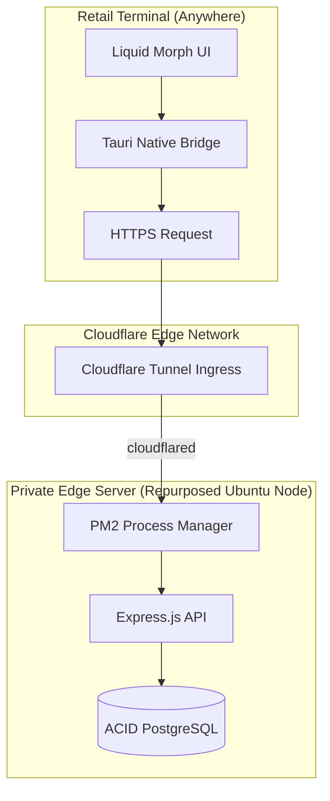

# 💎 Abaya Park Enterprise POS v0.4.0
### Hybrid-Cloud Point of Sale Architecture for Luxury Retail

> **Note to Reviewers:** This is a sanitized, public-facing repository structured specifically for architectural demonstration. The primary development, containing proprietary commercial retail data and granular commit history, is maintained in a private enterprise repository.

## 🏛️ Executive Summary

**Abaya Park POS** is a high-performance, enterprise-grade point of sale ecosystem engineered to solve systemic operational bottlenecks in luxury retail environments. Forged from commercial necessity rather than academic theory, it was initially developed as an internal, proprietary solution to modernize and stabilize high-volume retail operations. The system represents a strategic pivot from traditional cloud-only architectures to a **resource-efficient, localized-first model**. 

In the fast-paced retail sector, recurring cloud computing costs and network latency act as systemic drains on revenue. Abaya Park POS bypasses these commercial vulnerabilities entirely through a bespoke **Hybrid-Cloud Private Edge Architecture**. By repurposing legacy hardware into a dedicated on-premise Unix node and securing global ingress via Cloudflare Tunnels, the system delivers the zero-latency transaction speed of a local tool combined with the global scalability of a cloud platform—all while maintaining zero infrastructural overhead.

---

## 🌐 Interactive Architecture Demo

To facilitate review without requiring native desktop installation or risking proprietary security protocols, a sanitized, web-optimized version of the POS is hosted below. 

> **Architectural Note:** While the Tauri native bridge (Machine ID verification, Thermal Printing) is bypassed for web compatibility, **this is not a mocked frontend.** The demo actively queries a live test database hosted on the dedicated Private Edge Server via Cloudflare Tunnels, demonstrating real-time transaction speeds and hybrid-cloud data synchronization. In-app tooltips are provided to explain the bypassed production-level security mechanics.

---

## 🛠️ Technical Stack & Architectural Rationale

| Layer | Technology | Engineering Rationale |
| :--- | :--- | :--- |
| **Frontend Core** | React 18 + Vite | Ensures deterministic UI rendering and high-speed Hot Module Replacement (HMR) during development. |
| **Backend Engine** | Node.js (Express) | Asynchronous, event-driven architecture designed to handle high-throughput receipt printing and barcode scanning without blocking. |
| **Database** | PostgreSQL | Chosen over NoSQL for ACID compliance, ensuring that sensitive financial transactions and inventory counts never suffer from "eventual consistency." |
| **Native Bridge** | Tauri v2 (Rust) | Provides a security-first desktop wrapper with a near-zero memory footprint compared to Electron. |
| **Design System** | Vanilla CSS3 | Custom-built "Liquid Morph" Neumorphic interface to maintain branding consistency and ultra-smooth animations. |
| **Edge Logic** | Cloudflare Workers | Proxies update signatures and sensitive binaries to prevent public exposure of the build server. |

---

## 🚀 Key Features

### 🛒 High-Fidelity Transaction Processing
*   **Atomic Checkout**: Every sale is processed within a database transaction, guaranteeing that stock levels and sales logs are updated simultaneously or not at all.
*   **Intelligent Returns**: Modular refund logic allows for partial returns, balance collection, and automated inventory restock.

### 📲 Omnichannel Identity & QR Sync
*   **QR Connect (Profile Sync)**: Seamlessly syncs customer profile details (name, phone, email, loyalty points) from their mobile devices directly into the POS checkout flow. The register generates a temporary session ID displayed as a dynamic QR code; when scanned by the customer, they verify their identity (via Google Login or OTP) and the POS polls the server in real-time (sub-2s latency) to load their profile details, eliminating manual data entry mistakes.
*   **QR-Based Mobile Media Upload (Pic Upload)**: Empowers sales associates or customers to scan a session-specific QR code displayed on the register, opening a secure, temporary media upload interface at `pic-upload.abayapark.com`. Users can capture reference photos or videos directly from their smartphone cameras and upload them. The server streams these media assets directly to the POS custom order form in real-time via WebSockets/event-listeners, avoiding native app overhead.
*   **3-Digit Display Pairing Gate**: Secures public-facing staff display mirroring routes (`abayapark.com/display/[shop_id]`) used to mirror register data onto external monitors. The display page enforces a zero-trust gate, requiring the viewer to type the transient 3-digit security pairing passcode currently displayed in the register's QR Connect drawer. Only matching codes allow the server to release the display stream, neutralizing unauthorized remote snooping.

### 📋 Custom Order Management & Blueprint Sketching
*   **Interactive Blueprint Sketcher**: Supports custom order sheets including detailed tailoring measurements (length, chest, sleeves, shoulder, hips, etc.). Includes an interactive abaya design blueprint selector (Open/Closed front, Pocket, Sleeve Buttons, Feeding Zip) and drawing canvases to sketch physical abaya customizations.
*   **Reference Model Image Syncing**: Mapped reference product catalog images to custom orders dynamically. This displays catalog pictures in the order's reference media panel (supporting individual deletion) without creating duplicate image uploads in the Cloudflare R2 bucket.
*   **Silent Background Syncing**: Uses background event listening (`'inventory-refresh-needed'`) to silently refresh the catalog, orders, and sales tables immediately after stock batches are committed or orders are created, removing manual refresh delays.

### 📦 Optimized Inventory Intelligence
*   **Normalized Library Architecture**: Centralized product metadata (pricing, cost, tags) within a `product_library`, allowing multiple shop locations to share high-fidelity data while maintaining local stock counts.
*   **AI-Ready Tagging**: Structured product tags and metadata provide the foundation for future predictive inventory forecasting models.

### 🎨 "Liquid Morph" UI/UX
*   **Physical UI Feedback**: Sidebars and carts utilize cubic-bezier elastic transitions to provide a "physical" feel that reduces cognitive load for sales associates.
*   **Responsive Engine**: A custom CSS system optimized for both 4K terminals and high-density tablet displays.

### 🧠 Self-Healing AI "Brain" (Phase 1)
*   **Multimodal RAG Memory**: The system utilizes a Retrieval-Augmented Generation (RAG) architecture. It "learns" from human edits to product overviews, storing them as "Lessons" in a PostgreSQL vector-ready table to improve future generations.
*   **Self-Correction Loops**: Every AI output is audited by an internal "Grader" model. If the AI hallucinates details not found in the product specs, the system automatically triggers up to 2 self-correction retries to "heal" the summary before it reaches the user.
*   **Cloudflare Workers AI**: Powered by `Llama 3.2 Vision`, allowing the system to "see" product images and describe them with high fidelity while maintaining zero API costs.

---

## 🚀 AI Orchestration & Resource Economics

A defining operational success of this project was its capital efficiency. The entire enterprise-grade architecture was developed with **$0.00 in API overhead**. 

Operating as the lead Systems Architect, I designed the structural blueprints and system logic, while orchestrating open-source AI agents and free-tier models to handle the granular code execution across the stack. This hybrid workflow—human architectural vision paired with AI-accelerated execution—allowed me to deploy enterprise-grade features while drastically compressing development timelines and eliminating software capital expenditures.

---

## 🏗️ Enterprise Architecture & Scale

The core engineering triumph of Abaya Park POS was abandoning expensive, metered cloud backends (like Supabase) in favor of a **Self-Hosted Private Edge Server**. 

* **Zero-Cost Infrastructure via Hardware Recycling**: Rather than incurring monthly AWS or Vercel database fees, I repurposed a depreciated legacy laptop into a dedicated enterprise server running Ubuntu via Windows Subsystem for Linux (WSL). This transformed sunk hardware costs into a high-performance compute node with unlimited storage and zero recurring overhead.
* **Production Daemonization**: To ensure enterprise-grade uptime in a retail environment, the Node.js/Express backend and PostgreSQL database are managed via **PM2**, guaranteeing automatic restarts, load balancing, and crash resilience without manual intervention.
* **AI-Guided Global Ingress (Cloudflare Tunnels)**: To achieve global accessibility without compromising local network security, I leveraged AI infrastructure assistants to help architect and configure a `cloudflared` zero-trust tunnel. This creates an encrypted, outbound-only connection to the Cloudflare Edge, allowing the localized POS to be securely managed from anywhere in the world while remaining invisible to external port scanners.
* **AI-Executed Differentiated Routing**: Early single-page deployments suffered from severe caching conflicts and data pollution. I diagnosed the bottleneck and conceptualized a strictly differentiated routing architecture (isolating `/posview` from `/reports`). I then directed AI assistants to execute this structural refactoring based on my parameters, ensuring stable navigation across terminal devices.

---

## 🔐 Threat-Model Driven Security & Data Integrity

Building for a commercial retail brand requires uncompromising security to protect revenue and proprietary data. Operating as the systems architect, I conducted the business threat modeling—identifying specific operational vulnerabilities—and then orchestrated AI coding assistants to translate my security requirements into cryptographic implementations.

### 1. Insider Threat Mitigation (Multi-Factor Authentication & WhatsApp OTP)
* **The Vulnerability:** Standard PIN logins are susceptible to staff sharing and social engineering, while traditional email or SMS OTPs can have high latency or cost overhead.
* **The AI-Executed Solution:** I mandated an absolute system gatekeeper and integrated a WhatsApp-Based OTP Authentication engine utilizing the high-performance **`@whiskeysockets/baileys`** library. By migrating from a heavy, Chromium-dependent `whatsapp-web.js` browser wrapper to a lightweight WebSockets-based WhatsApp engine, we reduced RAM consumption by ~500MB+ per process and avoided browser startup failures. OTP verification codes are generated instantly and delivered via WhatsApp messaging, ensuring secure multi-factor authentication for staff.

### 2. Asset Protection (Hardware-Locked Activation)
* **The Vulnerability:** The risk of unauthorized software cloning or running the proprietary POS on unverified, off-site devices.
* **The AI-Executed Solution:** I conceptualized a device-restriction protocol. Utilizing AI assistants, I implemented a script to capture a unique machine fingerprint (via `get_machine_id`) and verify it against a localized `activated_devices` table, ensuring the software only executes on authorized retail hardware.

### 3. Supply-Chain Defense (Digital Signature Verification)
* **The Vulnerability:** Malicious actors intercepting the update pipeline to push compromised software to the retail terminals.
* **The AI-Executed Solution:** I required zero-trust update verification. I tasked AI with configuring cryptographic signing for production binaries using **Ed25519 signatures**. The resulting update pipeline (built with a custom `build-release.cjs`) automatically rejects any binary that fails the signature check.

### 4. Local Network Defense (The Guardian Key Protocol)
* **The Vulnerability:** Because the POS backend operates on a localized network, any rogue device connected to the store's Wi-Fi could theoretically attempt to query the API or spoof transaction requests.
* **The AI-Executed Solution:** I conceptualized a strict API gateway defense. I directed AI coding assistants to implement a "Guardian Key" protocol—a secret cryptographic token injected at the native Rust (Tauri) layer. The Node.js backend actively drops any network request that does not carry this specific native signature, completely neutralizing internal network threats.

### 5. Public DNS Access Masking (SPA Security Mask)
* **The Vulnerability:** To allow customers/associates to upload photos via mobile camera rolls without native wrappers, routes like `/mobile-upload/*` must be publicly accessible. However, exposing the main POS bundle on a public domain is a critical reconnaissance vector.
* **The AI-Executed Solution:** I implemented an application-level security mask. If the app is visited via a public domain (such as `pic-upload.abayapark.com` or `*.pages.dev`), the SPA inspects the routing parameters at startup. If the path is anything other than `/mobile-upload/*`, it immediately returns a sterile, static 404 block ("Resource unavailable at this origin"), hiding the admin login gate from internet scanners.

---

## 🧠 Strategic Engineering & Optimization

### I. High-Throughput State Management
* **The Business Problem:** In a high-volume retail environment handling 10,000+ SKUs, standard React state management became bottlenecked, causing micro-stutters during checkout. In retail, UI lag translates directly to slower queue processing and diminished customer experience.
* **The AI-Accelerated Solution:** I architected a **Domain-Driven Context Separation** pattern. I directed AI coding assistants to systematically decouple the monolithic state into isolated `InventoryContext`, `SalesContext`, and `AuthContext` environments. This eliminated unnecessary re-renders and guaranteed a sub-50ms UI response time during rapid barcode scanning.

### II. Database Schema Normalization & Profit Protection
* **The Business Problem:** Initial rapid-prototyping designs duplicated pricing data across individual stock entries. This created a severe commercial liability: "data drift," where a single product could display conflicting prices across different store locations, threatening profit margins and accounting accuracy.
* **The AI-Accelerated Solution:** I redesigned the PostgreSQL schema to a strict **Product Library -> Data** relational model. I then utilized AI data-migration scripts to safely port legacy records into this single source of truth, guaranteeing 100% brand-wide price consistency and zero data anomalies.

### III. UI Performance vs. Hardware Economics
* **The Business Problem:** The Abaya Park brand required a premium, luxury "Liquid Morph" (Neumorphic) interface. However, heavy CSS shadows and Glassmorphic blurs historically tank GPU performance on cost-effective, low-end retail hardware. 
* **The Engineering Solution:** Rather than forcing the business to purchase expensive high-end POS terminals, I optimized the design system at the rendering level. By strictly utilizing `backdrop-filter: blur()` and isolating repaints to hardware-accelerated CSS variables, I successfully deployed a luxury UI overlay while maintaining a flawless 60FPS on budget hardware.

---

## 🖥️ System Interface & Execution

**Caption:** *Demonstration of the hardware-accelerated Neumorphic UI during a high-throughput atomic checkout sequence.*

**Caption:** *The centralized Product Library view, pulling normalized data from the local PostgreSQL node.*

**Caption:** *Real-Time Business Intelligence Dashboard. Demonstrating the zero-latency visualization of localized PostgreSQL sales data and omnichannel revenue metrics within the hardware-accelerated UI.*

---

## 🗺️ Phase 2: Strategic Scaling Roadmap

With the localized POS architecture stabilized, the immediate commercial roadmap focuses on digital revenue expansion and predictive analytics:

- [ ] **Unified E-Commerce Bridge**: Developing a seamless data synchronization pipeline to connect the localized PostgreSQL inventory with a new customer-facing Next.js web storefront.
- [ ] **AI-Driven Spec Extraction**: (Phase 2) Upgrading the AI Brain to automatically suggest and write product specifications (fabric, model, work) by scanning multiple product images simultaneously.
- [ ] **Predictive Inventory Forecasting**: Integrating a lightweight model (LightGBM) to analyze historical transaction data and forecast seasonal stock-out events for luxury collections.
- [ ] **Customer Lifetime Value (CLV)**: Deploying a centralized analytics dashboard to calculate and visualize CLV based on omnichannel purchase frequency.

---
© 2026 Abaya Park. Designed & Engineered with a focus on Applied AI Business Excellence.
